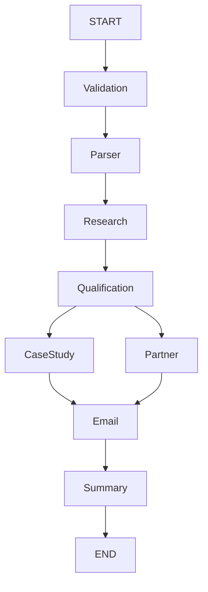

# FlytBase AI Sales Assistant
### Autonomous Sales Lead Qualification Agent using LangGraph

An AI-powered multi-agent sales assistant built with **LangGraph**, **LangChain**, and **Groq** that automates the inbound lead qualification workflow for enterprise sales teams.

Starting from a raw customer email, the system validates the input, extracts lead information, performs real-time company research using public web sources, qualifies the lead, recommends relevant FlytBase case studies and go-to-market strategy, generates a personalized email sequence, and produces an Account Executive (AE) handoff summary.

The application includes a Streamlit dashboard that allows every stage of the workflow to be inspected independently.

---

# System Architecture



The workflow is implemented using **LangGraph StateGraph**, where every node updates a shared application state.

---

# Workflow

## 1. Validation
- Validates the incoming email.
- Ensures required fields are present.
- Prevents invalid inputs from entering the workflow.

## 2. Lead Parsing
Uses structured LLM output to extract key parameters into a structured **Pydantic schema**:
- Name, Designation, Company, Industry, Country, Email, Pain Points, Timeline, and Lead Summary.

## 3. Company Research
Performs real-time web research using the **Tavily Search API** to gather public data:
- Company overview & Headquarters.
- Recent announcements & strategic news.
- Budget signals & operational priorities.
- Potential drone use cases and FlytBase solution fit.

## 4. Lead Qualification
Evaluates the lead using the **BANT framework** to determine:
- Budget, Authority, Need, Timeline, Fit Score, Qualification Reason, and Missing Information.

## 5. Case Study Matching
Searches public FlytBase case studies and selects the most relevant customer success story based on industry, business problems, and operational requirements.

## 6. Partner Recommendation
Determines the recommended Go-To-Market (GTM) strategy (Direct AE Engagement or Partner-led Motion) based on lead region, qualification, and partner availability.

## 7. Email Sequence Generation
Generates a personalized three-email outreach sequence matching the buyer's seniority, utilizing company research, referencing case studies, and asking discovery questions for missing data.

## 8. AE Summary
Produces a concise Account Executive briefing summarizing the lead overview, qualification status, top research highlights, recommended case study, GTM strategy, potential risks, and next steps.

---

# Tech Stack

| Component | Technology |
| ------------ | ------------ |
| **Agent Orchestration** | LangGraph |
| **LLM Framework** | LangChain |
| **LLM Provider** | Groq (Llama 3.3 70B & Llama 3.1 8B) |
| **Web Research** | Tavily Search API |
| **Validation & Schemas** | Pydantic |
| **Frontend UI** | Streamlit |
| **Language** | Python |

---

# Project Structure

```
flytbase_ai_agent/
│
├── nodes/
│   ├── validation.py
│   ├── parser.py
│   ├── research.py
│   ├── qualification.py
│   ├── case_study.py
│   ├── partner.py
│   ├── email.py
│   └── summary.py
│
├── graph.py
├── state.py
├── app.py
├── requirements.txt
└── README.md
```

---

# Installation

Clone the repository:
```bash
git clone <repository-url>
cd flytbase_ai_agent
```

Create and activate a virtual environment:
```bash
# Create venv
python -m venv venv

# Activate (Windows)
venv\Scripts\activate

# Activate (Linux / macOS)
source venv/bin/activate
```

Install dependencies:
```bash
pip install -r requirements.txt
```

---

# Environment Variables

Create a `.env` file in the project root:
```env
GROQ_API_KEY=your_groq_api_key
TAVILY_API_KEY=your_tavily_api_key
```

---

# Run the Application

Launch the Streamlit interface:
```bash
streamlit run app.py
```

---

# Features

- **LangGraph Multi-Agent Workflow** with robust state orchestration.
- **Structured Outputs** validated via Pydantic schemas.
- **Real-Time Research** powered by Tavily Search API.
- **Dynamic Case Study Matching** & GTM recommendation logic.
- **Adaptive Personalization** for email outreach sequence.
- **Interactive Streamlit Dashboard** for clear process inspection.

---

# Author

**Om Gaikwad**  
*B.E. Artificial Intelligence & Data Science*
